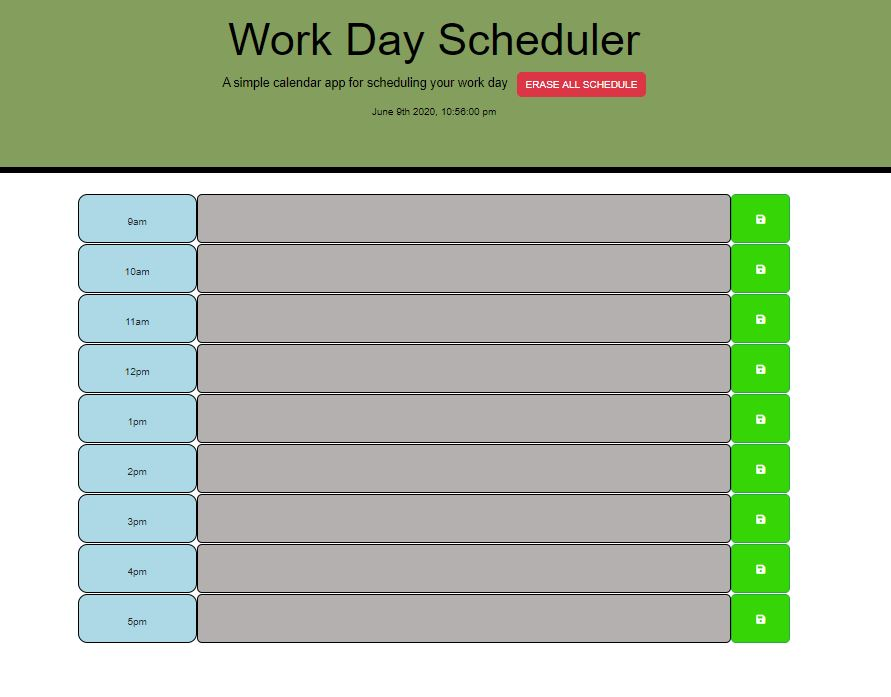

##  Work Day Scheduler

This is a simple calendar application that allows the user to save events for each hour of the day from 9am to 5pm. This app will run in the browser and feature dynamically updated HTML and CSS powered by jQuery.

The user types in events in the textbox corresponding to the relevant row hours and can save by clicking the save button on the far right. All events saved are stored locally and will remain in the text box until cleared or user click 'ERASE ALL SCHEDULE'.

##  
The current date and time are dynamically upated at the top using Moment.js. 
Additionally, each row is dynamically updated by color based on the current time as follows:
Grey: Past hours from current hour
Red: The current hour 
Green: Future hours

Link to app: https://mikewclee.github.io/Work-Day-Scheduler/

